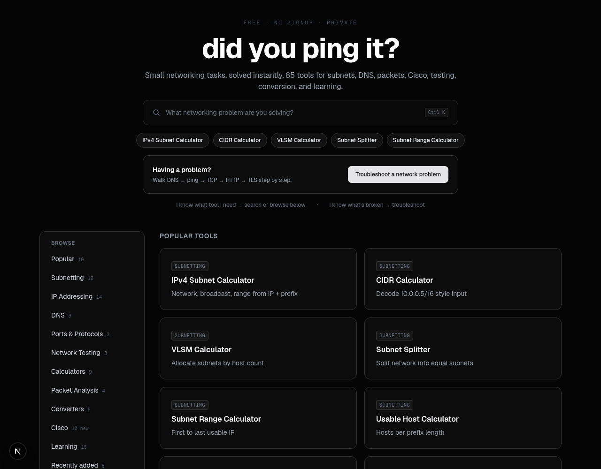
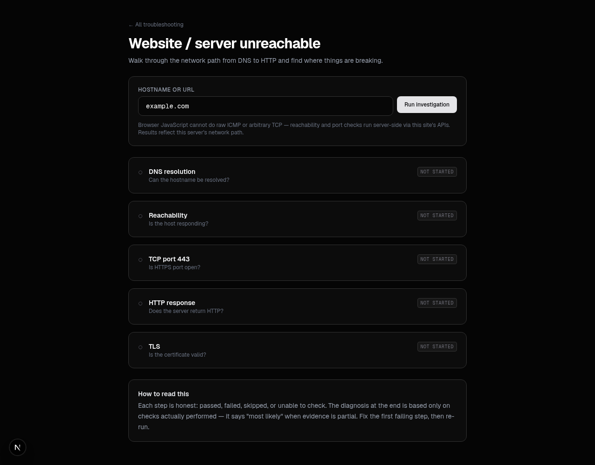

# did you ping it?

Free, privacy-first networking tools. 85 utilities plus guided troubleshooting workflows. No signup, no database.

Live site: https://didyoupingit.com

## Screenshots





## What it is

Two ways to use the site:

- **I know what tool I need** — search or browse the toolbox: subnetting, IP addressing (v4/v6), DNS, ports and protocols, network testing, packet analysis, calculators, converters, Cisco, learning drills and references.
- **I know what's broken** — start at `/troubleshoot`. The first workflow, Website / server unreachable (`/troubleshoot/unreachable`), walks DNS to reachability to TCP 443 to HTTP to TLS in order, explains each result in plain English, and produces a diagnosis based only on checks actually performed.

## Stack

Next.js 16 (App Router) + TypeScript + Tailwind CSS 4 + shadcn/ui (zinc). Vitest for tests. Optional PostHog analytics behind a same-origin `/ingest` proxy (see `next.config.ts` rewrites).

## Quick start

```bash
npm ci
npm run dev
```

Open http://localhost:3000.

Available scripts:

```bash
npm test        # vitest
npm run typecheck
npm run lint
npm run build
npm start       # serve production build
```

## Environment

Everything runs without configuration. Analytics stays off until both vars are set:

```bash
NEXT_PUBLIC_POSTHOG_PROJECT_TOKEN=
NEXT_PUBLIC_POSTHOG_HOST=https://us.i.posthog.com
```

See `.env.example`. For containers, copy `.env.docker.example` to `.env`.

## Self-host with Docker

Additive to the repo on purpose: the Vercel deployment ignores these files, so the hosted site and self-hosted image build from the same source with no special cases.

```bash
cp .env.docker.example .env
docker compose up --build
```

Open http://localhost:3000.

Notes:

- Image is multi-stage `node:22-bookworm-slim` with `iputils-ping`, `traceroute`, `whois`, and `ca-certificates` installed for the live-check APIs.
- Compose grants `NET_RAW` so ping can use real ICMP. Without it, `/api/ping` automatically falls back to TCP connect on 443/80 and says so in the response.
- Healthcheck hits `/`. No volumes, no database, no state on disk.

## How live checks work

Most tools are pure client-side calculators. The ones that need the network call same-origin APIs under `src/app/api/`:

| API | What it does |
| --- | --- |
| `/api/dns` | A/AAAA/MX/CNAME/TXT/NS via `node:dns`, 8s timeout |
| `/api/dns/reverse` | PTR lookup |
| `/api/ping` | System `ping` (ICMP) first, TCP-connect fallback, labeled honestly |
| `/api/tcp` | Single-port TCP probe (`?host=&port=`) |
| `/api/traceroute` | `traceroute` with `tracepath` fallback, honest 501 when binaries missing |
| `/api/headers` | Server-side fetch with manual redirect handling, 12s abort |
| `/api/asn`, `/api/bgp` | Origin AS via Team Cymru DNS |
| `/api/whois` | TCP/43 with referral following |
| `/api/propagation` | Parallel A-record checks across public resolvers |
| `/api/geo` | IP geolocation with disclaimer |

Browser JavaScript cannot do raw ICMP or arbitrary TCP, so reachability and port checks always run server-side. The troubleshooting workflow states this on the page instead of faking results. Private/internal targets are refused (403) via SSRF guards in `src/lib/dns.ts`.

## Project layout

```text
src/app/<tool>/page.tsx        # Server component: metadata + ToolShell
src/app/<tool>/calculator.tsx  # Client component: inputs, live results
src/app/api/*/route.ts         # Server-only live checks (force-dynamic)
src/app/troubleshoot/          # Guided workflows (separate from TOOLS registry)
src/lib/                       # Pure logic: ipv4, ipv6, dns guards, packets,
                               # netcalc, cisco, learn, tools index, troubleshoot model
src/components/                # ToolShell, tool-ui, SearchPalette, ui/
tests/                         # Vitest suites per area
```

Conventions for new tools: pure functions in `src/lib` (null on invalid input, no UI imports), colocation of calculator next to its page, every page gets unique metadata, example, explanation, FAQ with JSON-LD, related links, copy/reset buttons, and explicit error states. Register the tool in `src/lib/tools.ts` and `src/app/sitemap.ts`.

## Privacy

Calculators run in your browser. Server lookups happen on demand when you run them and are never logged by this app. No accounts, no history, no stored hostnames. Analytics (if configured) is page/tool-usage events only.

## Contributing

```bash
npm test
npm run typecheck
npm run lint
npm run build
```

All four must pass. Add tests for new calculation or decision logic, keep error messages specific (no "something went wrong"), and reuse existing libs/APIs instead of duplicating implementations.
